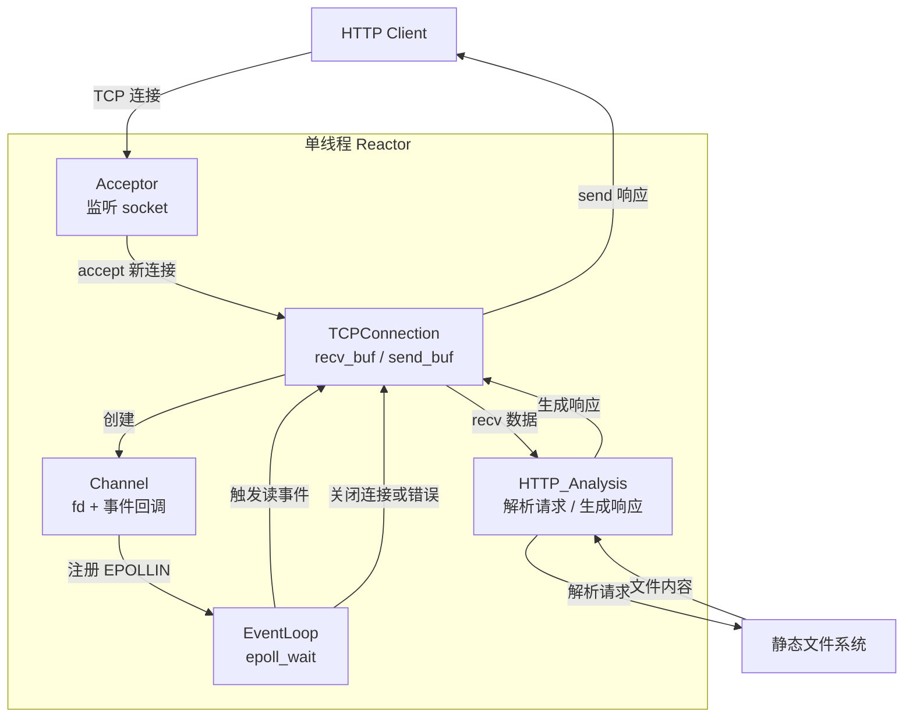
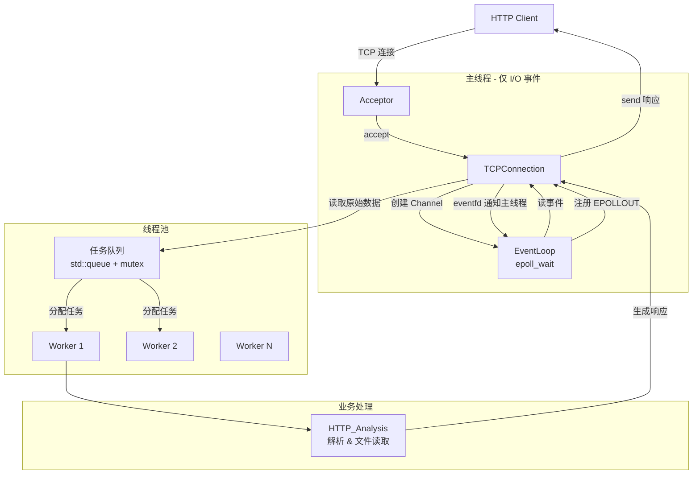

# Reactor-HTTP-Server  
这是一个基于C++从零构建的单Reactor模式HTTP服务器，支持GET请求和静态资源，具有单线程和线程池版本，并通过高并发压力测试  
-----------------------------   
## 核心特性  
- **事件驱动架构**:基于epoll的单Reactor模型，支持边沿触发(ET)和非阻塞I/O  
- **HTTP/1.0支持**:手动实现HTTP解析器，支持GET请求，返回200/404状态码  
- **多线程演进**:提供单线程和线程池两个版本，将I/O与计算分离，充分利用多核CPU  
- **模块化错误处理**:全局错误管理模块，实现唯一的关闭连接路径，妥善处理大部分TCP异常  
- **高性能**:单线程版本QPS超15k，多线程版本可稳定处理数千并发连接，支持wrk压力测试  
- **健壮的内存管理**:利用 *shared_ptr/weak_ptr* 解决多线程下对象生命周期问题  
- **日志系统**:支持文件输出的轻量级日志，可分别记录连接、系统的错误信息

## 架构设计  
### 单线程Reactor(main)    


### 线程池Reactor(feature/threads)  


## 性能测试  

使用**wrk**在本地回环进行压力测试(测试文件: *hello.txt*，约 50 字节):

| 版本                  | 并发数    |    QPS      | 平均延迟   |
| :--------------------:| :------: | :---------: | :--------: |
| 单线程(accept优化后)   | 50       | 22415       | 2.05ms   |
| 单线程(accept优化后)   | 100      | 21055       | 4.34ms   |
| 单线程(accept优化后)   | 12500    | 18487       | 208ms    |
| 线程池                 | 100     | 3394         | 15.78ms  |
| 线程池                 | 1000    | 2705         | 187ms    |

> 详细数据及交互式图表请查看 [完整压测报告](https://Charon-gl.github.io/Reactor-HTTP-Server/wrk_data/test_data.html)。

## 目录结构  
```text
Reactor_Server/  
|  
|——build/  
|  
|——include/  
|  |—— Acceptor.hpp  
|  |—— Channel.hpp  
|  |—— Err_Manager.hpp  
|  |—— err_to_string.hpp  
|  |—— EventLoop.hpp  
|  |—— HTTP_Analysis.hpp  
|  |—— Logger.hpp  
|  |—— Server.hpp  
|  |—— TCPConnection.hpp  
|  |—— ThreadPool.hpp       #features/threads only  
|  
|——Log/  
|  
|——src/  
|  |—— main.cpp  
|  |—— Acceptor.cpp  
|  |—— Channel.cpp  
|  |—— Err_Manager.cpp  
|  |—— err_to_string.cpp  
|  |—— EventLoop.cpp  
|  |—— HTTP_Analysis.cpp  
|  |—— Logger.cpp  
|  |—— Server.cpp  
|  |—— TCPConnection.cpp  
|  |—— ThreadPool.cpp       #features/threads only  
|  
|——CMakeLists.txt
```  

## 快速开始  
### 环境要求  
  - Linux (支持epoll)  
  - C++17 编译器(g++ 7+ 或 clang 5+)  
  - CMake 3.10+  
### 编译与运行  
```bash  
#克隆仓库
git clone https://github.com/Charon-gl/Reactor-HTTP-Server.git
cd Reactor-HTTP-Server

#tips:默认监听0.0.0.0:6666(可进入src/main.cpp修改监听端口)，请根据实际静态资源目录修改src/HTTP_Analysis.cpp63行的URL路径：
#auto URL = "资源路径" + ...

#单线程版本(main分支)
git checkout main
mkdir build && cd build
cmake ../ && make
./Server

#线程池版本(feature/threads分支)
git checkout feature/threads
mkdir build && cd build
cmake ../ && make
./Server
```

## 技术难点与解决方案  
### 1. 架构设计与分工  
  从简单的echo服务器迭代到单Reactor模型，经历了多次重构。主要挑战在于明确各模块的职责： *EventLoop* 负责事件循环与分发, *Acceptor* 管理监听socket, *Channel* 作为事件载体, *TCPConnection* 管理单个连接。  
  通过回调链 *EventLoop* -> *Channel* -> *TCPConnection* -> *Server* 实现解耦，避免了循环引用和职责混乱。  
### 2. 错误处理与关闭机制  
  - **问题**:错误来源多样(epoll错误、系统调用返回-1)，且不同模块需要不同的处理策略。  
  - **方案**:设计 *Err_Manager* 类，仅根据 *errno* 返回操作等级 *IGNORE/RETRY/CLOSE_FD/CLOSE_ALL* ，具体操作由调用者执行。epoll错误事件则在 *Channel::handle_event()* 中直接处理。  
  - **优化**:为避免 *errno* 在后续多线程场景被覆盖，每个连接新增了成员 *_errno*保存当前的 *errno* 。 
### 3. 多线程下的对象生命周期管理  
  - **问题**:主线程执行发送任务时可能连接已被提前释放，回调可能会访问空指针。  
  - **方案**： *TCPConnection* 继承 *enable_shared_from_this* ，工作线程通过 *weak_ptr* 访问，尝试升级为 *shared_ptr* 成功再执行任务。主线程同理。主要就是在工作线程或者主线程执行任务过程中保证连接的存活。  
### 4. 性能优化  
  - **问题**:压力测试第二轮QPS几乎为0，原因是只处理了一个 *accept* 导致已完成连接队列堆积。  
  - **修复**: Acceptor 的fd读事件中循环调用 *accept* 直到 *EAGAIN* ，一次处理所有就绪连接，经过检测QPS提升约70%。  
  - **工具**:使用 *strace* 跟踪系统调用，定位到 *send* 未执行的原因是条件分支写错。

## 未来计划  
1. 支持HTTP/1.1 长连接 + 超时处理  
2. 实现主从Reactor模型
3. 进一步性能优化